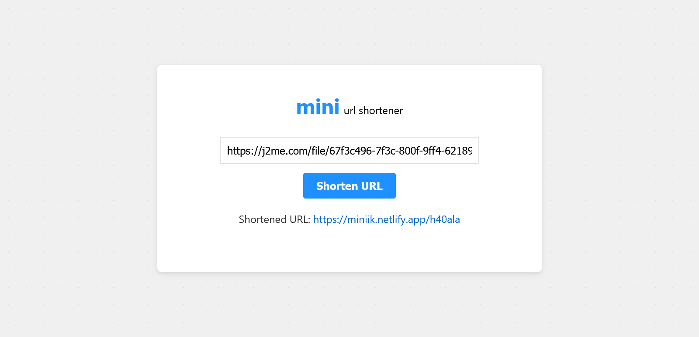

[](https://app.netlify.com/sites/miniik/deploys)

# minik (or miniLink)
## URL Shortener

**minik** is a simple and efficient URL shortener tool that allows users to shorten long URLs for easier sharing and tracking. The tool is hosted on Netlify and is accessible via the link below:

### Live Demo
[Visit minik](https://miniik.netlify.app)

---

### Features
- **URL Shortening**: Quickly shorten long URLs for easy sharing.
- **Custom Short Codes**: Option to use custom short codes for better recall.
- **Analytics**: Track clicks on your shortened URLs (future feature).
- **Responsive Design**: Optimized for both desktop and mobile devices.

---

### Screenshot
Here’s a preview of the live application:



---

### How to Use
1. Enter a long URL in the input box.
2. Click the "Shorten URL" button.
3. Copy the generated shortened URL and share it.

---

### Technologies Used
- **Frontend**: HTML, CSS, JavaScript
- **Backend**: Firebase Firestore for storing URLs
- **Hosting**: Netlify

---

### Development
To run the project locally:
1. Clone the repository:
   ```bash
   git clone https://github.com/abraham-ny/minik.git
